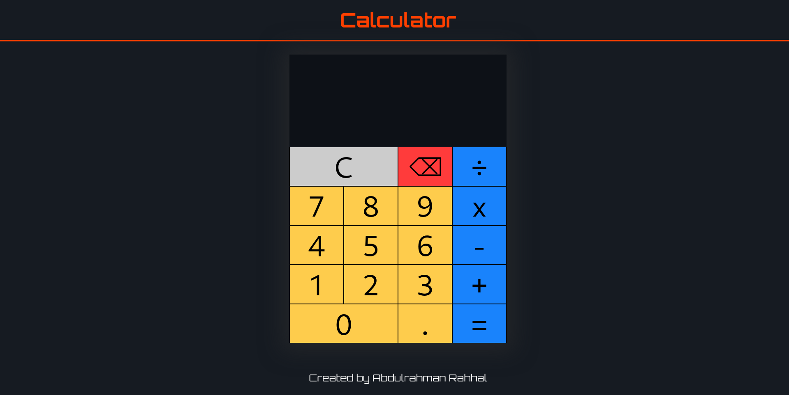

# Calculator

This is a solution to the [The Odin Project](https://www.theodinproject.com).

## Table of contents

- [Overview](#overview)
  - [Screenshot](#screenshot)
  - [Links](#links)
- [Author](#author)

## Overview

the project is a web application calculator with a nice UI, the calculator do the basic operations like sum, substract, multiply and division with only tow operands.

### Screenshot

### Links

- [Live Site](https://rahhaly.github.io/calculator)

## Author

- LinkedIn - [Abdulrahman Rahhal](https://www.linkedin.com/in/abdulrahman-rahhal-b28119250/)
- Mostaqil - [عبد الرحمن رحال](https://mostaql.com/u/AbdulRahman17)